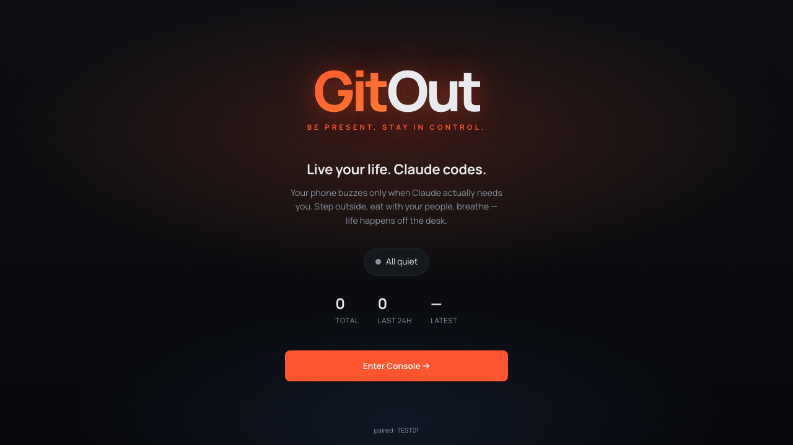
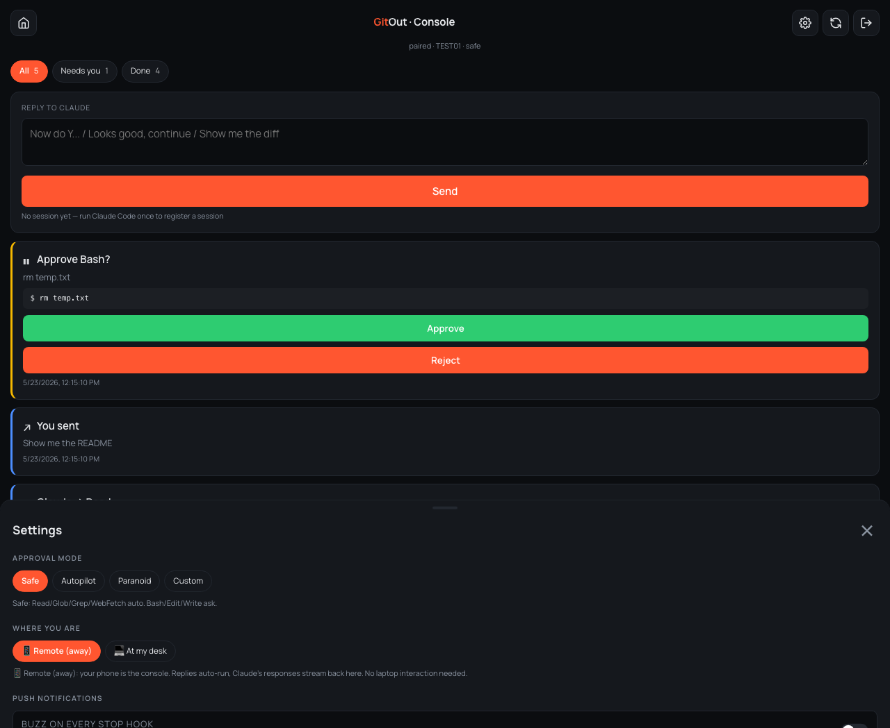
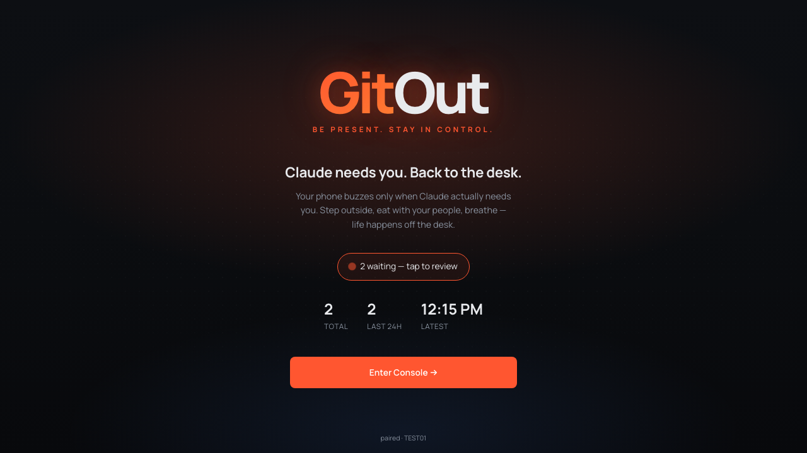
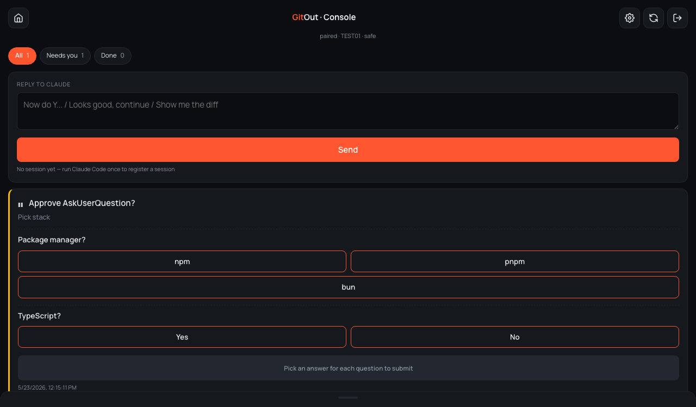

# GitOut — phone control for Claude Code

**Live life. AI codes.**

GitOut is a free, open-source VS Code extension + Progressive Web App that lets you babysit Claude Code from your phone. Approve tool calls, answer questions, send follow-up instructions — all from anywhere.

---

## ⚖️ Important: No central service

GitOut is **client-only software**. There is no GitOut server, no GitOut backend, no GitOut SaaS. All code runs on:

- **Your laptop** — the VS Code extension and local agent daemon
- **Your phone** — the Progressive Web App
- **Cloudflare's anonymous quick tunnel** (default) — or your own Cloudflare account if you opt to self-host

The maintainer of GitOut **operates no infrastructure**, **collects no data**, and **has no access** to your sessions, code, or Claude conversations.

---

## Install

1. Open VS Code → Extensions panel (`⇧⌘X`)
2. Search **"GitOut"**
3. Click **Install**

Or install from the [Marketplace page](https://marketplace.visualstudio.com/items?itemName=innovate-with-sanjeev.gitout).

## Quickstart (3 minutes)

Prerequisite: [Claude Code](https://docs.claude.com/en/docs/claude-code/getting-started) installed.

1. Open the Command Palette (`⇧⌘P`) → **GitOut: Start**
2. A side panel opens with a QR code
3. Scan the QR code with your phone → the GitOut PWA opens
4. On your phone, tap **Pair & enable notifications**
5. (Recommended) Add the PWA to your home screen: Safari → Share → Add to Home Screen
6. You're paired. When Claude needs you, your phone buzzes.

## What it does

| From your phone, you can: | How |
|---|---|
| **Approve tool calls** | Bash / Edit / Write tool calls show the actual diff or command. One-tap approve or reject. |
| **Answer Claude's questions** | When Claude uses `AskUserQuestion`, the options render as tappable buttons. |
| **Send follow-up instructions** | Type a nudge; Claude runs it and streams the response back to your phone. |
| **Configure per-tool policy** | Safe / Autopilot / Paranoid / Custom — set once, forget. |

## Screenshots

|  |  |
|---|---|
|  |  |
|  |  |

## Modes

| Mode | What happens |
|---|---|
| 📱 **Remote** | Claude SDK runs your reply, response streams back to your phone. Use when you're away from the desk. |
| 💻 **Desk** | Your reply lands in VS Code's Claude chat input. Use when you're back at the laptop. |

Toggle in Settings on the phone.

---

## Cost: $0 forever

GitOut is designed to **never cost you a cent** and **never cost the maintainer a cent**:

| Component | Hosted on | Who pays |
|---|---|---|
| VS Code extension | Your laptop | $0 — you |
| Agent daemon (Node) | Your laptop | $0 — you |
| Default tunnel | Cloudflare's free anonymous quick-tunnel pool | $0 — Cloudflare absorbs |
| Optional permanent URL | **Your own** Cloudflare Workers free tier | $0 — your free tier |
| Push notifications | FCM (Android) / APNS (iOS), free for low volume | $0 — Google/Apple |

The maintainer hosts **no shared infrastructure**. You will never be billed by GitOut, because there is nothing to bill for.

You may, optionally, self-host the relay Worker on your own Cloudflare account. If you choose to do so, you alone are responsible for your account, its usage, and any billing decisions you make on it. Cloudflare's free Workers plan does not require a credit card and cannot auto-upgrade you to a paid plan — but you should verify this on the Cloudflare dashboard before deploying anything.

## Privacy

- **No telemetry, no analytics, no account required.**
- The maintainer collects **zero data** — there is no server to collect it on.
- Your code, prompts, and Claude responses travel between your laptop and your phone via a Cloudflare tunnel — see [Cloudflare's privacy policy](https://www.cloudflare.com/privacypolicy/) for what they retain.
- The pairing code is a short-lived secret known only to your laptop and your phone.
- Source code for the agent and worker is **not** open-source at this time. The VS Code extension source ships inside the `.vsix` package (minified) and can be inspected by unzipping it.

## Requirements

- VS Code 1.80+ (any OS)
- [Claude Code](https://docs.claude.com/en/docs/claude-code/getting-started) installed
- A modern phone with a browser (iOS 16.4+ or any Chrome-based Android)
- For the default zero-setup mode: nothing else
- For the optional permanent URL mode: a free [Cloudflare](https://dash.cloudflare.com/sign-up) account

## Issues & feedback

Found a bug? Want a feature? File an [issue](https://github.com/AI-First-Community/gitout-public/issues/new/choose). See [CONTRIBUTING.md](CONTRIBUTING.md) for what info to include.

---

## ⚖️ Disclaimer

GitOut is provided **"as is"** under the [MIT license](LICENSE), without warranty of any kind, express or implied. By installing or using GitOut, you acknowledge and agree that:

1. **No infrastructure is operated by the maintainer.** GitOut runs entirely on your own hardware and on third-party services you choose (Cloudflare, FCM, APNS). The maintainer has no ability to monitor, control, or recover your sessions.

2. **You are solely responsible** for any third-party accounts you use with GitOut (Cloudflare, Apple developer push services, Google FCM) — including all billing, terms of service, and account decisions made on those platforms.

3. **No data is collected, transmitted to, or stored by the maintainer.** All data flow happens between devices you own and third-party services you have agreed to use.

4. **The maintainer is not liable** for any data loss, downtime, billing surprises, security incidents, or damages arising from the use of, or inability to use, this software. See the [MIT license](LICENSE) for the full warranty disclaimer.

5. **GitOut is not affiliated with, endorsed by, or sponsored by** Anthropic, Cloudflare, Apple, Google, Microsoft, or any other organization. "Claude" and "Claude Code" are trademarks of Anthropic; "VS Code" is a trademark of Microsoft. GitOut interoperates with these products as an independent third-party tool.

6. **Use at your own risk.** AI-generated code can be wrong, unsafe, or incomplete. Always review tool calls before approving them, especially destructive ones (file deletion, force pushes, database mutations). One-tap convenience does not replace one-tap review.

If any of these terms are unacceptable to you, do not install or use GitOut.

---

## License

[MIT](LICENSE) — free to use, modify, and redistribute. See [LICENSE](LICENSE) for the full text.

Built with [Claude Code](https://docs.claude.com/en/docs/claude-code/) and `@anthropic-ai/claude-agent-sdk`.
